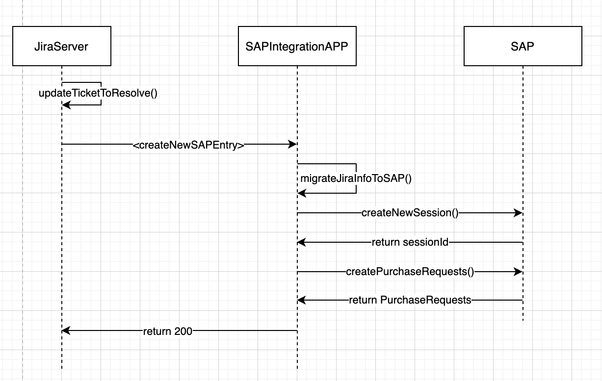

# Overview

This repository contains a micro-service project that migrates information that Jira send about purchases, map them to SAP models and saves them.

## Flow

The flow is going to be triggered by Jira when a purchase ticket is mark as resolved. When that event happens it will 
create a new REST request with the mandatory information of the ticket, so it can be migrated to SAP. 



### Considerations

Some considerations must be taken into account for the integration. 

1) SAP have different DBs that will depend on the company selected in the Jira ticket. That's why we have multiple 
DBs configuration based on this input. The application was implemented having into account that a new company can be 
created, and it can be added as part of the configuration with no implementation changes.
That being said, the configuration logic will depend that the companies names follow some standard and they don't repeat
themselves, in order to guarantee the correct usage.

2) In order to avoid the usage of some sort of storage or big configurations, we decided that some Jira fields will
contain in their value the SAP id that we need to use when mapping the ticket. The format should be standardize and MUST
be follow.

## Deployment

The application will be hosted in a Digital Ocean instance (please contact mmunoz@makingsense.com or 
fdecun@makingsense.com to get access to), and the process of deployment is manually.

1) Generate the JAR file locally
2) Upload the JAR file into the instance
3) Run the JAR as mentioned below

As mentioned in the [Flow](#Flow) section, Jira will trigger a REST call to the application, so the map to SAP can be performed. 
Due to Jira restrictions, the application MUST be running at port 80.
This is an example of how to run the application:

```
java -jar -Dserver.port=80 
    -Dsap.purchase.configurations.biside.db= 
    -Dsap.purchase.configurations.biside.user= 
    -Dsap.purchase.configurations.biside.password= 
    -Dsap.purchase.configurations.making.db= 
    -Dsap.purchase.configurations.making.user= 
    -Dsap.purchase.configurations.making.password= 
    -Dsap.purchase.configurations.doppler.db= 
    -Dsap.purchase.configurations.doppler.user= 
    -Dsap.purchase.configurations.doppler.password= 
    sap-jira-0.0.1-SNAPSHOT.jar
```

## Environment setup

In order to run the application you MUST have installed java 8 in your local machine and access to MS VPN to try out the
flow.

To compile the application, run unit test and generate the executable jar, please run the following command at the root
of the repository:

```
./mvnw clean package
```

When using the SAP test environment you will need to configure the application.properties correctly or add the
properties when executing the executables. Depending on the company selected on the ticket you will map a particular
SAP DB, that's why you have 3 different configurations.

Edit the file [application.properties](src/main/resources/application.properties):

```
sap.purchase.configurations.making.db=
sap.purchase.configurations.making.user=
sap.purchase.configurations.making.password=

sap.purchase.configurations.doppler.db=
sap.purchase.configurations.doppler.user=
sap.purchase.configurations.doppler.password=

sap.purchase.configurations.biside.db=
sap.purchase.configurations.biside.user=
sap.purchase.configurations.biside.password=
```

or, include them when executing the application (make sure 8080 port is not being used, or change it to another):

```
java -jar -Dserver.port=8080 
    -Dsap.purchase.configurations.biside.db= 
    -Dsap.purchase.configurations.biside.user= 
    -Dsap.purchase.configurations.biside.password= 
    -Dsap.purchase.configurations.making.db= 
    -Dsap.purchase.configurations.making.user= 
    -Dsap.purchase.configurations.making.password= 
    -Dsap.purchase.configurations.doppler.db= 
    -Dsap.purchase.configurations.doppler.user= 
    -Dsap.purchase.configurations.doppler.password= 
    sap-jira-0.0.1-SNAPSHOT.jar
```

The values to be used are managed by SAP team. Please contact them to get the correct information for each environment
you are working with.

## Tech stack

The technologies used for this project are:

    * Java 8
    * Spring Framework
    * Spring Boot
    * Maven

